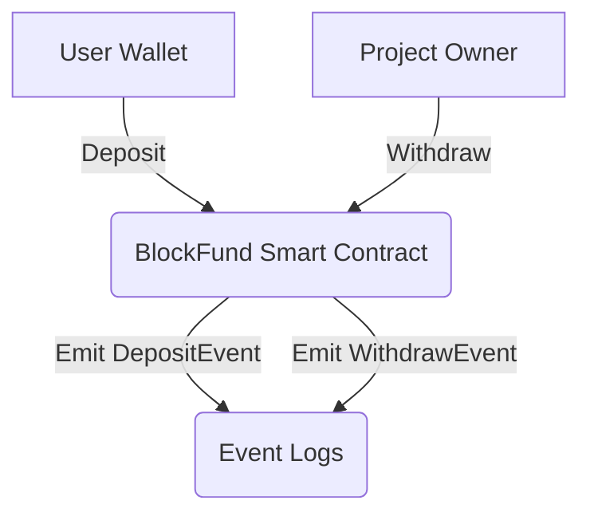
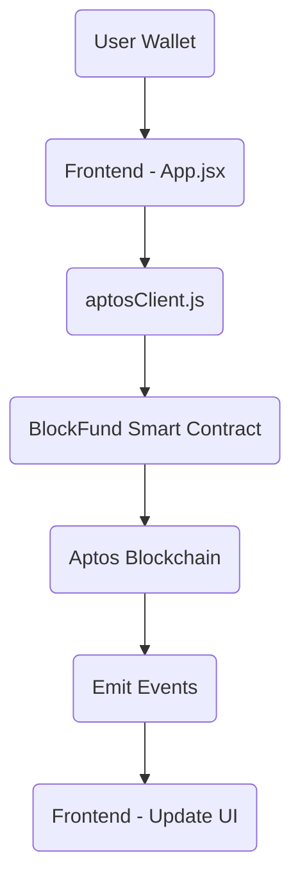
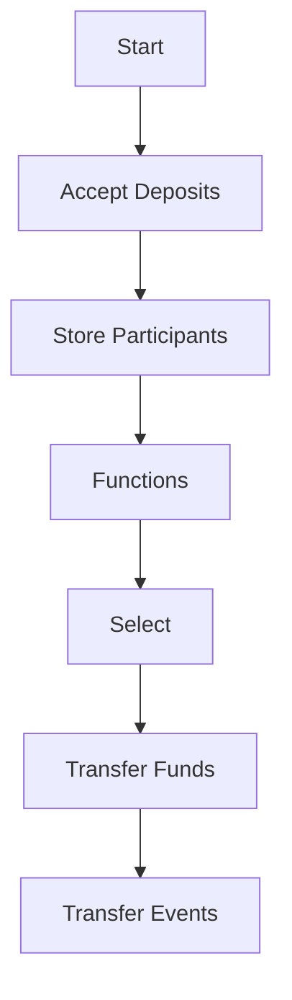
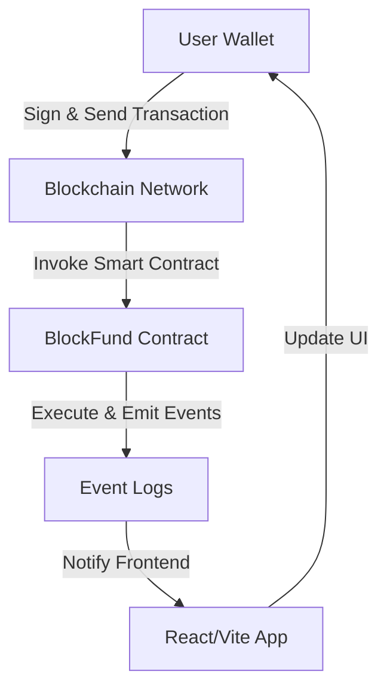

---

# 🎁 BlockFund — Decentralized Donation Pool  
> **Built on Aptos Blockchain using the Move Smart Contract Language**

---

## 📌 Table of Contents  

- [Overview](#overview)
- [Motivation](#motivation)
- [Key Features](#key-features)
- [Technical Architecture](#technical-architecture)
- [Project Structure](#project-structure)
- [Smart Contract Details](#smart-contract-details)
- [Development Setup](#development-setup)
- [Deployment Guide](#deployment-guide)
- [Testing & Interaction](#testing--interaction)
- [Example Usage & Event Logs](#example-usage--event-logs)
- [Learning Outcomes](#learning-outcomes)
- [Potential Improvements](#potential-improvements)
- [License](#license)
- [Contributors](#contributors)

---

## 📖 Overview  

**BlockFund** is a decentralized, transparent, and secure donation management system designed to operate entirely on the **Aptos blockchain** using the **Move programming language**.  
It allows users to contribute tokens into a **collective funding pool** and lets a pre-defined **project owner** securely withdraw these funds under strict smart contract permissions.

The project aims to solve trust and transparency issues commonly found in traditional and even centralized Web3 donation platforms by removing intermediaries and making every transaction **verifiable, immutable, and public**.  

By leveraging **Aptos’ advanced Move resource model**, it ensures that donated funds are safely held in a single verifiable vault, which only the contract deployer (project owner) can access, significantly reducing risks of fund mismanagement.

This was developed during a **technical bootcamp** aimed at teaching Web3 developers how to:
- Write Move smart contracts
- Deploy and interact via **Aptos CLI & Devnet**
- Build simple Web3 frontends integrated with on-chain smart contracts

---

## 🎯 Motivation  

Donation systems — both Web2 and many Web3 implementations — are heavily reliant on intermediaries and trust assumptions.  
These limitations manifest as:
- Lack of transparency
- Misuse of funds  
- Delayed processing  
- Hidden or high intermediary fees  
- Limited public accountability  

**BlockFund** aims to directly address these by:
- **Eliminating intermediaries** through smart contract automation  
- Ensuring **complete public visibility of all deposits and withdrawals** on Aptos chain  
- **Binding donation control to strict Move resource-based access control**
- Guaranteeing that **no unauthorized or accidental fund movements are possible**
- Using **Aptos' parallel transaction processing** to handle high transaction loads efficiently without congestion
- Offering **real-time event logs** for donors to monitor every interaction transparently

It bridges the trust gap by making blockchain technology accessible to people with limited experience through a **simple, beginner-friendly Web3 frontend**, allowing them to engage in decentralized philanthropy confidently.

---

## 🚀 Key Features  

- **Decentralized Donation Pool**  
  Users can securely deposit tokens into a smart contract vault visible and verifiable by all.

- **Owner-Restricted Withdrawals**  
  Only the **contract deployer (project owner)** has permission to withdraw the total accumulated funds via the Move module.

- **Real-Time On-Chain Event Logging**  
  Emits `DepositEvent` and `WithdrawEvent` events with transaction metadata, providing **complete transaction history tracking**.

- **Move Resource Ownership Enforcement**  
  The `DonationVault` is implemented as a **resource struct**, which cannot be copied, reassigned, or destroyed arbitrarily.  
  This makes fund management safer and tamper-proof.

- **Aptos CLI & Devnet Integration**  
  Fully compatible with Aptos CLI for **deployment, interaction, and testing** on Devnet.

- **Optimized Move Safety Guarantees**  
  Leverages **Aptos’ linear type system** to prevent double-spending, lost funds, or unauthorized transfers by design.

- **Beginner-Friendly Web Frontend**  
  A simple **React + Vite frontend** was built for bootcamp participants to:
  - Connect their Aptos wallet  
  - Enter donation amounts  
  - Send transactions  
  - View transaction history  

- **Aptos Ecosystem Advantages**  
  Utilizes Aptos-specific innovations like:
  - **Move resource-based vault management**  
  - **Parallel transaction processing** (BlockSTM)  
  - **Efficient event logging system**  
  - Faster and more scalable transaction finality compared to other L1 blockchains like Ethereum or Solana

---

## 🛠️ Technical Architecture  






---

## 🛠️ Technologies Used

| Layer            | Technologies                       |
|:-----------------|:------------------------------------|
| **Blockchain**     | Aptos CLI, Move Language, Devnet    |
| **IDE**             | Remix IDE for Move                   |
| **Frontend**        | HTML, CSS, Vanilla JS, Vite, Axios   |

---

### 🛠️ Contract Control Flow  

1. **User deposits** tokens via `deposit()`  
2. Contract increments vault balance in `DonationVault`  
3. Emits `DepositEvent`  
4. **Project owner** initiates `withdraw()`  
5. Contract checks signer authority  
6. Transfers vault funds to owner’s address  
7. Emits `WithdrawEvent`

---

### 🛠️ Aptos-Specific Advantages  

- **Move Resource Safety**  
  Unlike Solidity, Move’s linear types and resources **prevent accidental duplication or unauthorized deletion** of assets.  
  `DonationVault` is safe, as it exists as a **single-owner resource** tied to the deployer’s address.

- **Event System**  
  Aptos offers an **efficient and queryable event store**, making it easier to track and fetch transaction logs without complex off-chain infrastructure.

- **Parallel Execution (BlockSTM)**  
  Aptos’ transaction parallelism processes multiple deposits and withdrawals concurrently without nonce conflicts — unlike serial-executing chains like Ethereum.

- **Fast Finality**  
  Aptos finalizes transactions in sub-second latency, providing a **smooth UX** in frontend interactions.

---

### 🛠️ Frontend Interaction Flow  

The frontend is a **simple but effective** React + Vite application allowing users to:
- **Connect their Aptos wallet** via Petra/Martian  
- **Input a donation amount** in APT  
- **Send the transaction** to the smart contract via Aptos SDK  
- **Display transaction success/failure feedback**  
- **List recent donation transactions**

This was intentionally built for **beginner bootcamp participants** to get hands-on experience without overcomplicating the UI/UX or code structure.  
It follows a **modular, single-page layout** to keep the learning curve friendly.

---

# 📁 BlockFund Project Structure

```
blockfund/
├── move/                          
│   ├── sources/
│   │   └── blockfund.move      
│   ├── scripts/
│   │   └── deposit.move          
│   │   └── withdraw.move          
│   └── Move.toml                 
├── frontend/                    
│   │   └── index.html             
│
│   ├── src/
│   │   └── App.jsx                
│   │   └── aptosClient.js    
│   │   └── main.js              
│
│   ├── package.json             
│   ├── vite.config.js             
│
├── README.md
```                    


---

## 📜 Smart Contract Details  

### 📂 Module: `blockfund.move`  
**Structs:**  
- `DonationVault`  
  Holds the total balance in a Move `resource` struct, ensuring it can only be managed by the contract logic.

**Events:**  
- `DepositEvent`  
- `WithdrawEvent`

**Functions:**  
- `initialize()`  
  Creates the `DonationVault` resource under the signer’s account.

- `deposit()`  
  Transfers a given token amount from the caller into the `DonationVault`.  
  Updates balance, emits `DepositEvent`.

- `withdraw()`  
  Permissioned function allowing **only the deployer account** to transfer the total balance to themselves.  
  Emits `WithdrawEvent`.

**Technical Notes:**  
- Move’s `aptos_coin::transfer()` ensures safe token movement  
- The contract enforces **ownership checks** using `signer::address_of()`  
- Events are emitted using `aptos_std::event::emit_event()`  
- Uses **linear Move resources** to prevent duplication or unauthorized modification

---


## 📊 Smart Contract Logic Flow




---


## 📥 Installation

### 1️⃣ Install Aptos CLI  
Follow the official [Aptos CLI installation guide](https://aptos.dev/tools/cli/install-cli).

### 2️⃣ Set Up Move Development Environment  
Use [Remix IDE for Move](https://remix.ethereum.org) or set up a local environment as needed.

### 3️⃣ Compile the Project  

aptos move compile


## 🧪 Example Usage & Event Logs  

**Deposit:**  
```
aptos move run --function-id default::blockfund::deposit --args u64:50000000
```

**Withdraw:**  
```
aptos move run --function-id default::blockfund::withdraw
```

**Check Event Logs:**  
```
aptos view --function-id default::blockfund::get_events
```

# 📦 Usage

## ✅ Move Smart Contract

### 1️⃣ Compile the Project
```
aptos move compile
```

### 2️⃣ Publish Smart Contract
```
aptos move publish --package-dir /sources
```

### 3️⃣ Fund a Project (As a Funder)
```
aptos move run --function blockfund::fund --args 100
```

### 4️⃣ Withdraw Funds (As a Project Owner)
```
aptos move run --function blockfund::withdraw
```

### 5️⃣ View Funders and Logs
```
aptos move view --function blockfund::get_funders
```

---

## 🎨 Frontend

### 1️⃣ Install Node.js and npm  
Download and install [Node.js](https://nodejs.org/en/) — it includes npm by default.

Verify installation:
```
node -v
npm -v
```

### 2️⃣ Initialize a Frontend Project
```
npx create-vite@latest blockfund-frontend -- --template vanilla
cd blockfund-frontend
npm install
```

### 3️⃣ Install Axios (for Aptos API calls)
```
npm install axios
```

### 4️⃣ Create a Simple Interface

**/index.html**
```
<button id="fund-btn">Fund Project</button>
<button id="withdraw-btn">Withdraw Funds</button>
<div id="funders-list"></div>
```

**/main.js**
```
document.getElementById('fund-btn').onclick = () => {
  alert('Funding project...');
};

document.getElementById('withdraw-btn').onclick = () => {
  alert('Withdrawing funds...');
};
```

### 5️⃣ Run the Frontend
```
npm run dev
```


## 🌐 Blockchain Interaction Flow




---


## 📚 Learning Outcomes  

- Move language resource-based security model  
- Aptos-specific contract deployment & testing  
- Event-driven smart contract design  
- Beginner-friendly React-based DApp development  
- CLI interaction with on-chain contracts  
- Safe fund management on decentralized platforms

---


## 🔧 Potential Improvements  

- Multi-owner shared vault support  
- Individual withdrawal limits and vesting schedules  
- Token type generalization via generic Move modules  
- On-chain metadata (project descriptions, deadlines, KPIs)
- Frontend event listener integration with real-time Aptos event APIs

---

##  🖊️ License
MIT License
This project is open-source and free to use for educational, personal, and commercial purposes.

---

## 👨‍💻 Contributors
Mert Çiçekci — Bootcamp Instructor & Blockchain Developer

---

## 👤 Contact

Bootcamp Instructor: Mert Çiçekci

Email: mertcicekci29@gmail.com

Website: www.patika.dev


